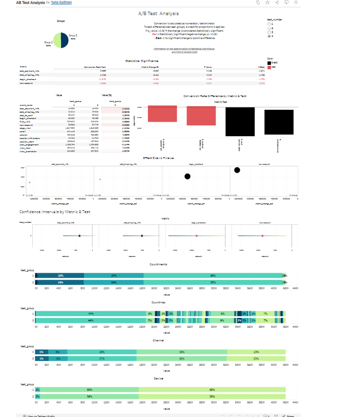

# ab-testing-analysis

A/B testing analysis: Python statistical significance testing + Tableau dashboard for conversion metrics

## Overview
This project analyzes A/B test results using Python for statistical significance 
testing and Tableau for interactive visualization of key conversion metrics.

## Goals
- Calculate statistical significance for 4 conversion metrics using Python (loops & arrays, no hardcoded logic)
- Visualize results in an interactive Tableau dashboard with test-level filtering

## Tools Used
- **Python** (Pandas, NumPy, Statsmodels) — Z-test for proportions
- **Tableau** — dashboard visualization

## Metrics Analyzed
- add_payment_info / session
- add_shipping_info / session
- begin_checkout / session
- new_account / session

## Key Findings
- **Test 1** showed statistically significant improvements in 3 out of 4 metrics 
  (add_payment_info +12.54%, add_shipping_info +6.56%, begin_checkout +6.66%) — the strongest performing test overall
- **Test 2** showed no statistically significant changes in any metric
- **Test 3** and **Test 4** showed statistically significant *decreases* in begin_checkout 
  conversion, suggesting the tested variant may have negatively impacted the checkout funnel
- Overall, 7 out of 16 test-metric combinations were statistically significant

## Dashboard
Interactive Tableau dashboard featuring:
- Statistical significance table (conversion rate, metric change %, p-value, z-stat)
- Conversion rate difference visualization by metric & test
- Effect Size vs P-Value scatter plot
- Confidence intervals by metric & test
- Breakdown by continent, country, channel, and device
- Filter by test number

## Notebook
🔗 [View Python analysis on Google Colab](https://colab.research.google.com/drive/1boDA3D5jR5RC1t1yxQebGXOUwZEI6UeI?usp=sharing)

## Results Data
📄 [Results CSV](https://drive.google.com/file/d/1yrXvSeBfm5maQsKGv9bQ45Ke4_KCmd20/view?usp=sharing)
